```plantuml
@startuml
...
@enduml
```

# CLAUDE.md

This file provides guidance to Claude Code (claude.ai/code) when working with code in this repository.

## Project Overview

UMSAT Labs is a Docusaurus v3 static documentation site for an engineering team's projects (robotics, electronics, IoT, DevOps). Deployed to GitHub Pages at https://jhoshoa.github.io/umsat-labs/.

## Build & Development Commands

```bash
npm start          # Development server with hot reload
npm run build      # Build static site to /build directory
npm run serve      # Serve built site locally
npm run clear      # Clear Docusaurus cache
```

Requires Node.js >= 20.0.

## Architecture

### Data-Driven Configuration

The site uses a centralized data file (`src/data/projects.json`) that drives:
- Homepage project cards
- Navbar dropdown items (generated in `docusaurus.config.ts`)
- Sidebar generation (dynamic in `sidebars.ts`)
- Footer links

To add a new project:
1. Add project entry to `src/data/projects.json` with id, title, description, link, tags, sidebar name, and sections array
2. Create corresponding `docs/{project-id}/` folder with README.md and numbered section folders
3. The sidebar auto-generates from the sections array in projects.json

### Sidebar Generation Pattern

`sidebars.ts` dynamically generates sidebars by iterating over `projects.json`:
- Each project gets a sidebar named `{project.sidebar}` (e.g., `cansatSidebar`)
- Sections use `autogenerated` type from `docs/{project-id}/{section-folder}/`
- Project overview linked via `{project-id}/README`

### Documentation Structure

```
docs/
├── {project-id}/
│   ├── README.md                    # Project overview (linked as sidebar root)
│   ├── 01-{section-name}/           # Numbered for ordering
│   │   ├── README.md                # Section overview (sidebar_position: 0)
│   │   └── 01-{Topic}.md            # Topics (sidebar_position: 1, 2, 3...)
│   └── 02-{section-name}/
│       └── ...
└── resources/                        # Shared resources (separate sidebar)
```

### Document Ordering

Use `sidebar_position` frontmatter to control prev/next button order within sections:
- Section README.md files: `sidebar_position: 0`
- Topic files: `sidebar_position: N` matching the filename prefix (01- = 1, 02- = 2, etc.)

```markdown
---
sidebar_position: 0
---

# Section Title
```

### PlantUML Support

Diagrams are rendered via `@akebifiky/remark-simple-plantuml`. Use in markdown:
```markdown

```

## Key Files

- `docusaurus.config.ts` - Site config, navbar/footer (reads from projects.json)
- `sidebars.ts` - Dynamic sidebar builder from projects.json
- `src/data/projects.json` - Central data for projects, sections, and tech stack
- `src/pages/index.tsx` - Homepage with hero, tech stack, and project cards
- `src/css/custom.css` - Theme with dark mode, custom fonts, neon styling

## Styling

- Fonts: Orbitron (headings), Space Grotesk (body), JetBrains Mono (code)
- Theme: Dark mode default with cyan accent (#00d4ff)
- Code highlighting: cpp, arduino, python, bash, json, yaml enabled
