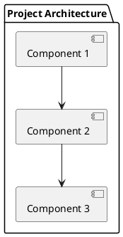
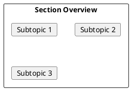

# Team Projects Documentation Site - Setup Prompt

> **Use this prompt to create a multi-project documentation hub for your engineering team.**

---

## THE PROMPT

Copy everything below and customize the `[PLACEHOLDERS]`:

---

# Setup Request: Team Projects Documentation Hub

## Project Overview

Create a modern, visually striking documentation site for our engineering team's projects using Docusaurus. The site showcases multiple projects (robotics, electronics, software, DevOps) with comprehensive documentation for each.

**Team Focus:** Technology, Software Development, Robotics, Electronics, IoT

**Site Purpose:** Central documentation hub for all team projects with professional presentation

---

## 1. Technology Stack

### Core Framework
- **Docusaurus v3.7.0+** - Static site generator
- **React 18.x** - UI framework
- **TypeScript** - Configuration files

### Dependencies (package.json)

```json
{
  "name": "[team-name]-docs",
  "version": "1.0.0",
  "private": true,
  "scripts": {
    "docusaurus": "docusaurus",
    "start": "docusaurus start",
    "build": "docusaurus build",
    "swizzle": "docusaurus swizzle",
    "deploy": "docusaurus deploy",
    "clear": "docusaurus clear",
    "serve": "docusaurus serve",
    "write-translations": "docusaurus write-translations",
    "write-heading-ids": "docusaurus write-heading-ids"
  },
  "dependencies": {
    "@docusaurus/core": "3.7.0",
    "@docusaurus/preset-classic": "3.7.0",
    "@mdx-js/react": "^3.0.0",
    "clsx": "^2.0.0",
    "prism-react-renderer": "^2.3.0",
    "react": "^18.3.1",
    "react-dom": "^18.3.1",
    "@fontsource/jetbrains-mono": "^5.0.0",
    "@fontsource/space-grotesk": "^5.0.0",
    "@fontsource/orbitron": "^5.0.0"
  },
  "devDependencies": {
    "@docusaurus/module-type-aliases": "3.7.0",
    "@docusaurus/types": "3.7.0",
    "typescript": "~5.6.2"
  },
  "browserslist": {
    "production": [">0.5%", "not dead", "not op_mini all"],
    "development": ["last 3 chrome version", "last 3 firefox version", "last 5 safari version"]
  },
  "engines": {
    "node": ">=18.0"
  }
}
```

### PlantUML Support (optional)
```json
"@akebifiky/remark-simple-plantuml": "^1.0.2"
```

---

## 2. Folder Structure (Project-Based)

```
[team-name]-docs/
├── docs/
│   ├── [project-1]/                         # First project (e.g., cansat)
│   │   ├── README.md                        # Project overview & goals
│   │   ├── 01-[section]/                    # First section
│   │   │   ├── README.md                    # Section overview
│   │   │   ├── 01-[Subtopic].md            # Subtopic file
│   │   │   ├── 02-[Subtopic].md
│   │   │   └── ...
│   │   ├── 02-[section]/                    # Second section
│   │   │   ├── README.md
│   │   │   └── ...
│   │   └── 03-[section]/
│   │       └── ...
│   │
│   ├── [project-2]/                         # Second project (e.g., lora-comm)
│   │   ├── README.md
│   │   ├── 01-[section]/
│   │   ├── 02-[section]/
│   │   └── ...
│   │
│   ├── [project-3]/                         # Third project (e.g., devops)
│   │   ├── README.md
│   │   ├── 01-[section]/
│   │   └── ...
│   │
│   └── resources/                           # Shared resources (optional)
│       ├── README.md
│       ├── tools/
│       ├── tutorials/
│       └── references/
│
├── src/
│   ├── components/
│   │   ├── HomepageFeatures/
│   │   │   ├── index.tsx                   # Project cards component
│   │   │   └── styles.module.css
│   │   └── TechStack/
│   │       ├── index.tsx                   # Tech stack showcase
│   │       └── styles.module.css
│   ├── css/
│   │   └── custom.css                      # Custom styling with cool fonts
│   └── pages/
│       ├── index.tsx                       # Landing page
│       └── index.module.css
│
├── static/
│   ├── img/
│   │   ├── logo.svg                        # Team logo
│   │   ├── logo-dark.svg                   # Dark mode logo
│   │   ├── projects/                       # Project images
│   │   │   ├── [project-1].png
│   │   │   ├── [project-2].png
│   │   │   └── ...
│   │   └── icons/                          # Tech icons
│   └── fonts/                              # Custom fonts (if self-hosting)
│
├── .github/
│   └── workflows/
│       └── deploy.yml                      # GitHub Pages deployment
│
├── docusaurus.config.ts
├── sidebars.ts
├── tsconfig.json
├── package.json
├── .gitignore
└── README.md
```

---

## 3. Example Project Structure

### Project: CanSat Mission

```
docs/
└── cansat/
    ├── README.md                           # Mission overview, goals, team
    ├── 01-mission-design/
    │   ├── README.md                       # Section overview
    │   ├── 01-Requirements.md              # Mission requirements
    │   ├── 02-SystemArchitecture.md        # System design
    │   └── 03-MissionProfile.md            # Flight profile
    ├── 02-hardware/
    │   ├── README.md
    │   ├── 01-Microcontroller.md           # MCU selection & setup
    │   ├── 02-Sensors.md                   # Sensor integration
    │   ├── 03-PowerSystem.md               # Battery & power management
    │   └── 04-PCBDesign.md                 # Circuit board design
    ├── 03-software/
    │   ├── README.md
    │   ├── 01-FlightSoftware.md            # Embedded code
    │   ├── 02-GroundStation.md             # Ground control software
    │   └── 03-DataProcessing.md            # Telemetry processing
    ├── 04-communication/
    │   ├── README.md
    │   ├── 01-RadioProtocol.md             # RF communication
    │   └── 02-Telemetry.md                 # Data transmission
    └── 05-testing/
        ├── README.md
        ├── 01-UnitTests.md
        └── 02-IntegrationTests.md
```

### Project: LoRa Communication System

```
docs/
└── lora-communication/
    ├── README.md
    ├── 01-fundamentals/
    │   ├── README.md
    │   ├── 01-LoRaBasics.md
    │   ├── 02-LoRaWAN.md
    │   └── 03-FrequencyBands.md
    ├── 02-hardware-setup/
    │   ├── README.md
    │   ├── 01-ModuleSelection.md
    │   ├── 02-AntennaDesign.md
    │   └── 03-Wiring.md
    ├── 03-software/
    │   ├── README.md
    │   ├── 01-LibrarySetup.md
    │   ├── 02-TransmitReceive.md
    │   └── 03-NetworkProtocol.md
    └── 04-projects/
        ├── README.md
        ├── 01-PointToPoint.md
        └── 02-MeshNetwork.md
```

### Project: DevOps Infrastructure

```
docs/
└── devops/
    ├── README.md
    ├── 01-containerization/
    │   ├── README.md
    │   ├── 01-Docker.md
    │   ├── 02-DockerCompose.md
    │   └── 03-Kubernetes.md
    ├── 02-cicd/
    │   ├── README.md
    │   ├── 01-GitHubActions.md
    │   ├── 02-Pipelines.md
    │   └── 03-Deployment.md
    └── 03-monitoring/
        ├── README.md
        ├── 01-Prometheus.md
        └── 02-Grafana.md
```

---

## 4. Naming Conventions

### Projects (Top-Level Folders)
- Pattern: `project-name` (lowercase with hyphens)
- Examples: `cansat`, `lora-communication`, `devops`, `ground-station`

### Sections (Within Projects)
- Pattern: `NN-section-name` (numbered, lowercase with hyphens)
- Examples: `01-hardware`, `02-software`, `03-testing`

### Files
- Pattern: `NN-ConceptName.md` (numbered, PascalCase)
- Examples: `01-SystemArchitecture.md`, `02-SensorIntegration.md`

---

## 5. Landing Page (src/pages/index.tsx)

Create a visually striking landing page:

```tsx
import React from 'react';
import clsx from 'clsx';
import Link from '@docusaurus/Link';
import useDocusaurusContext from '@docusaurus/useDocusaurusContext';
import Layout from '@theme/Layout';
import styles from './index.module.css';

// Project Cards Data
const ProjectList = [
  {
    title: 'CanSat Mission',
    image: '/img/projects/cansat.png',
    description: 'Satellite-in-a-can competition project with telemetry and data analysis.',
    link: '/docs/cansat/',
    tags: ['Embedded', 'C++', 'Python', 'RF'],
  },
  {
    title: 'LoRa Communication',
    image: '/img/projects/lora.png',
    description: 'Long-range IoT communication system for remote sensor networks.',
    link: '/docs/lora-communication/',
    tags: ['IoT', 'LoRaWAN', 'Arduino', 'ESP32'],
  },
  {
    title: 'DevOps Infrastructure',
    image: '/img/projects/devops.png',
    description: 'CI/CD pipelines, containerization, and infrastructure as code.',
    link: '/docs/devops/',
    tags: ['Docker', 'K8s', 'GitHub Actions', 'Terraform'],
  },
];

function ProjectCard({title, image, description, link, tags}) {
  return (
    <div className={styles.projectCard}>
      <div className={styles.projectImageContainer}>
        
        <div className={styles.projectOverlay}>
          <Link to={link} className={styles.projectLink}>
            View Documentation →
          </Link>
        </div>
      </div>
      <div className={styles.projectContent}>
        <h3 className={styles.projectTitle}>{title}</h3>
        <p className={styles.projectDescription}>{description}</p>
        <div className={styles.tagContainer}>
          {tags.map((tag, idx) => (
            <span key={idx} className={styles.tag}>{tag}</span>
          ))}
        </div>
      </div>
    </div>
  );
}

function HeroSection() {
  const {siteConfig} = useDocusaurusContext();
  return (
    <header className={styles.heroBanner}>
      <div className={styles.heroBackground}>
        <div className={styles.gridLines}></div>
        <div className={styles.glowOrb}></div>
      </div>
      <div className={styles.heroContent}>
        <h1 className={styles.heroTitle}>
          <span className={styles.titleAccent}>[TEAM_NAME]</span>
          <br />
          Engineering Lab
        </h1>
        <p className={styles.heroSubtitle}>
          Building the future with <span className={styles.highlight}>robotics</span>,{' '}
          <span className={styles.highlight}>electronics</span>, and{' '}
          <span className={styles.highlight}>software</span>
        </p>
        <div className={styles.heroCta}>
          <Link className={styles.ctaButton} to="/docs/cansat/">
            Explore Projects
          </Link>
          <Link className={styles.ctaButtonSecondary} to="https://github.com/[org]">
            GitHub
          </Link>
        </div>
      </div>
      <div className={styles.scrollIndicator}>
        <span>↓</span>
      </div>
    </header>
  );
}

function TechStackSection() {
  const technologies = [
    { name: 'C/C++', icon: '⚡' },
    { name: 'Python', icon: '🐍' },
    { name: 'Arduino', icon: '🔧' },
    { name: 'ESP32', icon: '📡' },
    { name: 'Docker', icon: '🐳' },
    { name: 'Kubernetes', icon: '☸️' },
    { name: 'React', icon: '⚛️' },
    { name: 'PCB Design', icon: '🔌' },
  ];

  return (
    <section className={styles.techSection}>
      <h2 className={styles.sectionTitle}>Tech Stack</h2>
      <div className={styles.techGrid}>
        {technologies.map((tech, idx) => (
          <div key={idx} className={styles.techItem}>
            <span className={styles.techIcon}>{tech.icon}</span>
            <span className={styles.techName}>{tech.name}</span>
          </div>
        ))}
      </div>
    </section>
  );
}

function ProjectsSection() {
  return (
    <section className={styles.projectsSection}>
      <h2 className={styles.sectionTitle}>Active Projects</h2>
      <div className={styles.projectsGrid}>
        {ProjectList.map((props, idx) => (
          <ProjectCard key={idx} {...props} />
        ))}
      </div>
    </section>
  );
}

export default function Home(): JSX.Element {
  const {siteConfig} = useDocusaurusContext();
  return (
    <Layout
      title={`${siteConfig.title}`}
      description="Engineering team documentation hub">
      <main className={styles.mainContent}>
        <HeroSection />
        <TechStackSection />
        <ProjectsSection />
      </main>
    </Layout>
  );
}
```

---

## 6. Custom CSS with Cool Fonts (src/css/custom.css)

```css
/* ============================================
   FONT IMPORTS - Modern Tech Fonts
   ============================================ */
@import url('https://fonts.googleapis.com/css2?family=Orbitron:wght@400;500;600;700;800;900&display=swap');
@import url('https://fonts.googleapis.com/css2?family=Space+Grotesk:wght@300;400;500;600;700&display=swap');
@import url('https://fonts.googleapis.com/css2?family=JetBrains+Mono:wght@400;500;600;700&display=swap');
@import url('https://fonts.googleapis.com/css2?family=Exo+2:wght@400;500;600;700;800&display=swap');

/* ============================================
   CSS VARIABLES - Color Scheme
   ============================================ */
:root {
  /* Primary Colors */
  --ifm-color-primary: #00d4ff;
  --ifm-color-primary-dark: #00bfe6;
  --ifm-color-primary-darker: #00b4d9;
  --ifm-color-primary-darkest: #0094b3;
  --ifm-color-primary-light: #1ad9ff;
  --ifm-color-primary-lighter: #33ddff;
  --ifm-color-primary-lightest: #66e5ff;

  /* Accent Colors */
  --accent-neon-cyan: #00ffff;
  --accent-neon-purple: #bf00ff;
  --accent-neon-green: #00ff88;
  --accent-neon-orange: #ff6600;

  /* Background Colors */
  --bg-primary: #0a0a0f;
  --bg-secondary: #12121a;
  --bg-tertiary: #1a1a24;
  --bg-card: #16161f;

  /* Text Colors */
  --text-primary: #ffffff;
  --text-secondary: #a0a0b0;
  --text-muted: #6a6a7a;

  /* Fonts */
  --font-heading: 'Orbitron', 'Exo 2', sans-serif;
  --font-body: 'Space Grotesk', sans-serif;
  --font-code: 'JetBrains Mono', monospace;

  /* Docusaurus Overrides */
  --ifm-font-family-base: var(--font-body);
  --ifm-heading-font-family: var(--font-heading);
  --ifm-font-family-monospace: var(--font-code);
  --ifm-code-font-size: 85%;
  --docusaurus-highlighted-code-line-bg: rgba(0, 212, 255, 0.1);
}

/* Dark Theme Variables */
[data-theme='dark'] {
  --ifm-color-primary: #00d4ff;
  --ifm-color-primary-dark: #00bfe6;
  --ifm-color-primary-darker: #00b4d9;
  --ifm-color-primary-darkest: #0094b3;
  --ifm-color-primary-light: #1ad9ff;
  --ifm-color-primary-lighter: #33ddff;
  --ifm-color-primary-lightest: #66e5ff;

  --ifm-background-color: var(--bg-primary);
  --ifm-background-surface-color: var(--bg-secondary);
  --ifm-navbar-background-color: rgba(10, 10, 15, 0.95);
  --ifm-footer-background-color: var(--bg-primary);
}

/* ============================================
   GLOBAL STYLES
   ============================================ */
html {
  scroll-behavior: smooth;
}

body {
  font-family: var(--font-body);
  background: var(--bg-primary);
}

/* Headings */
h1, h2, h3, h4, h5, h6 {
  font-family: var(--font-heading);
  font-weight: 700;
  letter-spacing: 0.5px;
  text-transform: uppercase;
}

h1 {
  font-size: 2.5rem;
  letter-spacing: 2px;
  background: linear-gradient(135deg, var(--accent-neon-cyan), var(--accent-neon-purple));
  -webkit-background-clip: text;
  -webkit-text-fill-color: transparent;
  background-clip: text;
}

h2 {
  font-size: 1.8rem;
  color: var(--accent-neon-cyan);
  border-bottom: 2px solid var(--accent-neon-cyan);
  padding-bottom: 0.5rem;
}

h3 {
  font-size: 1.4rem;
  color: var(--text-primary);
}

/* Code Blocks */
code {
  font-family: var(--font-code);
  background: var(--bg-tertiary);
  border: 1px solid rgba(0, 212, 255, 0.2);
  border-radius: 4px;
}

pre {
  background: var(--bg-secondary) !important;
  border: 1px solid rgba(0, 212, 255, 0.3);
  border-radius: 8px;
  box-shadow: 0 0 20px rgba(0, 212, 255, 0.1);
}

pre code {
  font-family: var(--font-code);
  font-size: 14px;
  line-height: 1.6;
}

/* ============================================
   NAVBAR
   ============================================ */
.navbar {
  backdrop-filter: blur(10px);
  border-bottom: 1px solid rgba(0, 212, 255, 0.2);
}

.navbar__title {
  font-family: var(--font-heading);
  font-weight: 800;
  font-size: 1.3rem;
  letter-spacing: 2px;
  text-transform: uppercase;
  background: linear-gradient(90deg, var(--accent-neon-cyan), var(--accent-neon-green));
  -webkit-background-clip: text;
  -webkit-text-fill-color: transparent;
}

.navbar__link {
  font-family: var(--font-body);
  font-weight: 500;
  text-transform: uppercase;
  letter-spacing: 1px;
  font-size: 0.9rem;
  transition: color 0.3s ease, text-shadow 0.3s ease;
}

.navbar__link:hover {
  color: var(--accent-neon-cyan);
  text-shadow: 0 0 10px var(--accent-neon-cyan);
}

.navbar__link--active {
  color: var(--accent-neon-cyan);
}

/* ============================================
   SIDEBAR
   ============================================ */
.menu__link {
  font-family: var(--font-body);
  font-weight: 500;
  border-radius: 4px;
  transition: all 0.3s ease;
}

.menu__link:hover {
  background: rgba(0, 212, 255, 0.1);
  color: var(--accent-neon-cyan);
}

.menu__link--active {
  background: rgba(0, 212, 255, 0.15);
  color: var(--accent-neon-cyan);
  border-left: 3px solid var(--accent-neon-cyan);
}

.menu__list-item-collapsible {
  font-family: var(--font-heading);
  text-transform: uppercase;
  letter-spacing: 1px;
  font-size: 0.85rem;
}

/* ============================================
   CARDS & BOXES
   ============================================ */
.card {
  background: var(--bg-card);
  border: 1px solid rgba(0, 212, 255, 0.2);
  border-radius: 12px;
  transition: all 0.3s ease;
}

.card:hover {
  border-color: var(--accent-neon-cyan);
  box-shadow: 0 0 30px rgba(0, 212, 255, 0.2);
  transform: translateY(-2px);
}

/* Alert Boxes */
.alert {
  border-radius: 8px;
  border-left: 4px solid;
}

.alert--info {
  background: rgba(0, 212, 255, 0.1);
  border-color: var(--accent-neon-cyan);
}

.alert--warning {
  background: rgba(255, 102, 0, 0.1);
  border-color: var(--accent-neon-orange);
}

.alert--success {
  background: rgba(0, 255, 136, 0.1);
  border-color: var(--accent-neon-green);
}

/* ============================================
   TABLES
   ============================================ */
table {
  border-collapse: separate;
  border-spacing: 0;
  border-radius: 8px;
  overflow: hidden;
  border: 1px solid rgba(0, 212, 255, 0.3);
}

th {
  font-family: var(--font-heading);
  text-transform: uppercase;
  letter-spacing: 1px;
  font-size: 0.85rem;
  background: var(--bg-tertiary);
  color: var(--accent-neon-cyan);
  padding: 12px 16px;
}

td {
  padding: 12px 16px;
  border-bottom: 1px solid rgba(0, 212, 255, 0.1);
}

tr:hover td {
  background: rgba(0, 212, 255, 0.05);
}

/* ============================================
   BUTTONS
   ============================================ */
.button {
  font-family: var(--font-heading);
  text-transform: uppercase;
  letter-spacing: 1px;
  font-weight: 600;
  border-radius: 6px;
  transition: all 0.3s ease;
}

.button--primary {
  background: linear-gradient(135deg, var(--accent-neon-cyan), var(--ifm-color-primary-dark));
  border: none;
  box-shadow: 0 0 20px rgba(0, 212, 255, 0.3);
}

.button--primary:hover {
  box-shadow: 0 0 30px rgba(0, 212, 255, 0.5);
  transform: translateY(-2px);
}

/* ============================================
   FOOTER
   ============================================ */
.footer {
  background: var(--bg-primary);
  border-top: 1px solid rgba(0, 212, 255, 0.2);
}

.footer__title {
  font-family: var(--font-heading);
  text-transform: uppercase;
  letter-spacing: 1px;
  color: var(--accent-neon-cyan);
}

.footer__link-item {
  font-family: var(--font-body);
  transition: color 0.3s ease;
}

.footer__link-item:hover {
  color: var(--accent-neon-cyan);
}

/* ============================================
   CUSTOM COMPONENTS
   ============================================ */

/* Glowing Border Effect */
.glow-border {
  border: 1px solid transparent;
  background: linear-gradient(var(--bg-card), var(--bg-card)) padding-box,
              linear-gradient(135deg, var(--accent-neon-cyan), var(--accent-neon-purple)) border-box;
  border-radius: 12px;
}

/* Neon Text Effect */
.neon-text {
  color: var(--accent-neon-cyan);
  text-shadow:
    0 0 5px var(--accent-neon-cyan),
    0 0 10px var(--accent-neon-cyan),
    0 0 20px var(--accent-neon-cyan);
}

/* Tech Badge */
.tech-badge {
  display: inline-block;
  padding: 4px 12px;
  font-family: var(--font-code);
  font-size: 0.75rem;
  font-weight: 500;
  background: rgba(0, 212, 255, 0.1);
  border: 1px solid var(--accent-neon-cyan);
  border-radius: 20px;
  color: var(--accent-neon-cyan);
  text-transform: uppercase;
  letter-spacing: 0.5px;
}

/* Grid Lines Background */
.grid-background {
  background-image:
    linear-gradient(rgba(0, 212, 255, 0.03) 1px, transparent 1px),
    linear-gradient(90deg, rgba(0, 212, 255, 0.03) 1px, transparent 1px);
  background-size: 50px 50px;
}

/* Animated Gradient Border */
@keyframes gradient-rotate {
  0% { background-position: 0% 50%; }
  50% { background-position: 100% 50%; }
  100% { background-position: 0% 50%; }
}

.animated-border {
  background: linear-gradient(90deg, var(--accent-neon-cyan), var(--accent-neon-purple), var(--accent-neon-green), var(--accent-neon-cyan));
  background-size: 300% 300%;
  animation: gradient-rotate 5s ease infinite;
  padding: 2px;
  border-radius: 12px;
}

.animated-border > * {
  background: var(--bg-card);
  border-radius: 10px;
}

/* ============================================
   RESPONSIVE ADJUSTMENTS
   ============================================ */
@media (max-width: 768px) {
  h1 {
    font-size: 1.8rem;
    letter-spacing: 1px;
  }

  h2 {
    font-size: 1.4rem;
  }

  .navbar__title {
    font-size: 1rem;
  }
}

/* ============================================
   SCROLLBAR STYLING
   ============================================ */
::-webkit-scrollbar {
  width: 8px;
  height: 8px;
}

::-webkit-scrollbar-track {
  background: var(--bg-primary);
}

::-webkit-scrollbar-thumb {
  background: var(--accent-neon-cyan);
  border-radius: 4px;
}

::-webkit-scrollbar-thumb:hover {
  background: var(--accent-neon-purple);
}

/* ============================================
   SELECTION STYLING
   ============================================ */
::selection {
  background: var(--accent-neon-cyan);
  color: var(--bg-primary);
}
```

---

## 7. Landing Page Styles (src/pages/index.module.css)

```css
/* ============================================
   HERO SECTION
   ============================================ */
.heroBanner {
  position: relative;
  min-height: 100vh;
  display: flex;
  align-items: center;
  justify-content: center;
  overflow: hidden;
  background: var(--bg-primary);
}

.heroBackground {
  position: absolute;
  top: 0;
  left: 0;
  width: 100%;
  height: 100%;
  z-index: 0;
}

.gridLines {
  position: absolute;
  top: 0;
  left: 0;
  width: 100%;
  height: 100%;
  background-image:
    linear-gradient(rgba(0, 212, 255, 0.05) 1px, transparent 1px),
    linear-gradient(90deg, rgba(0, 212, 255, 0.05) 1px, transparent 1px);
  background-size: 60px 60px;
  animation: gridMove 20s linear infinite;
}

@keyframes gridMove {
  0% { transform: translate(0, 0); }
  100% { transform: translate(60px, 60px); }
}

.glowOrb {
  position: absolute;
  width: 600px;
  height: 600px;
  border-radius: 50%;
  background: radial-gradient(circle, rgba(0, 212, 255, 0.15) 0%, transparent 70%);
  top: 50%;
  left: 50%;
  transform: translate(-50%, -50%);
  animation: pulse 4s ease-in-out infinite;
}

@keyframes pulse {
  0%, 100% { transform: translate(-50%, -50%) scale(1); opacity: 0.5; }
  50% { transform: translate(-50%, -50%) scale(1.1); opacity: 0.8; }
}

.heroContent {
  position: relative;
  z-index: 1;
  text-align: center;
  padding: 2rem;
}

.heroTitle {
  font-family: 'Orbitron', sans-serif;
  font-size: 4rem;
  font-weight: 900;
  text-transform: uppercase;
  letter-spacing: 8px;
  line-height: 1.2;
  margin-bottom: 1.5rem;
  color: #ffffff;
}

.titleAccent {
  background: linear-gradient(135deg, #00ffff, #00ff88, #bf00ff);
  -webkit-background-clip: text;
  -webkit-text-fill-color: transparent;
  background-clip: text;
  text-shadow: none;
}

.heroSubtitle {
  font-family: 'Space Grotesk', sans-serif;
  font-size: 1.5rem;
  color: #a0a0b0;
  margin-bottom: 2rem;
  letter-spacing: 1px;
}

.highlight {
  color: #00ffff;
  font-weight: 600;
}

.heroCta {
  display: flex;
  gap: 1rem;
  justify-content: center;
  flex-wrap: wrap;
}

.ctaButton {
  font-family: 'Orbitron', sans-serif;
  font-size: 1rem;
  font-weight: 700;
  text-transform: uppercase;
  letter-spacing: 2px;
  padding: 1rem 2rem;
  background: linear-gradient(135deg, #00d4ff, #00ff88);
  color: #0a0a0f;
  border: none;
  border-radius: 8px;
  cursor: pointer;
  transition: all 0.3s ease;
  text-decoration: none;
  box-shadow: 0 0 30px rgba(0, 212, 255, 0.4);
}

.ctaButton:hover {
  transform: translateY(-3px);
  box-shadow: 0 0 50px rgba(0, 212, 255, 0.6);
  color: #0a0a0f;
  text-decoration: none;
}

.ctaButtonSecondary {
  font-family: 'Orbitron', sans-serif;
  font-size: 1rem;
  font-weight: 700;
  text-transform: uppercase;
  letter-spacing: 2px;
  padding: 1rem 2rem;
  background: transparent;
  color: #00ffff;
  border: 2px solid #00ffff;
  border-radius: 8px;
  cursor: pointer;
  transition: all 0.3s ease;
  text-decoration: none;
}

.ctaButtonSecondary:hover {
  background: rgba(0, 255, 255, 0.1);
  box-shadow: 0 0 30px rgba(0, 255, 255, 0.3);
  color: #00ffff;
  text-decoration: none;
}

.scrollIndicator {
  position: absolute;
  bottom: 2rem;
  left: 50%;
  transform: translateX(-50%);
  animation: bounce 2s infinite;
  color: #00ffff;
  font-size: 1.5rem;
}

@keyframes bounce {
  0%, 100% { transform: translateX(-50%) translateY(0); }
  50% { transform: translateX(-50%) translateY(10px); }
}

/* ============================================
   TECH STACK SECTION
   ============================================ */
.techSection {
  padding: 5rem 2rem;
  background: var(--bg-secondary);
}

.sectionTitle {
  font-family: 'Orbitron', sans-serif;
  font-size: 2rem;
  text-align: center;
  margin-bottom: 3rem;
  color: #ffffff;
  text-transform: uppercase;
  letter-spacing: 4px;
}

.techGrid {
  display: grid;
  grid-template-columns: repeat(auto-fit, minmax(150px, 1fr));
  gap: 1.5rem;
  max-width: 1000px;
  margin: 0 auto;
}

.techItem {
  display: flex;
  flex-direction: column;
  align-items: center;
  gap: 0.5rem;
  padding: 1.5rem;
  background: var(--bg-card);
  border: 1px solid rgba(0, 212, 255, 0.2);
  border-radius: 12px;
  transition: all 0.3s ease;
}

.techItem:hover {
  border-color: #00ffff;
  box-shadow: 0 0 20px rgba(0, 212, 255, 0.3);
  transform: translateY(-5px);
}

.techIcon {
  font-size: 2rem;
}

.techName {
  font-family: 'JetBrains Mono', monospace;
  font-size: 0.9rem;
  color: #00ffff;
  text-transform: uppercase;
  letter-spacing: 1px;
}

/* ============================================
   PROJECTS SECTION
   ============================================ */
.projectsSection {
  padding: 5rem 2rem;
  background: var(--bg-primary);
}

.projectsGrid {
  display: grid;
  grid-template-columns: repeat(auto-fit, minmax(350px, 1fr));
  gap: 2rem;
  max-width: 1200px;
  margin: 0 auto;
}

.projectCard {
  background: var(--bg-card);
  border: 1px solid rgba(0, 212, 255, 0.2);
  border-radius: 16px;
  overflow: hidden;
  transition: all 0.3s ease;
}

.projectCard:hover {
  border-color: #00ffff;
  box-shadow: 0 0 40px rgba(0, 212, 255, 0.2);
  transform: translateY(-5px);
}

.projectImageContainer {
  position: relative;
  height: 200px;
  overflow: hidden;
}

.projectImage {
  width: 100%;
  height: 100%;
  object-fit: cover;
  transition: transform 0.3s ease;
}

.projectCard:hover .projectImage {
  transform: scale(1.05);
}

.projectOverlay {
  position: absolute;
  top: 0;
  left: 0;
  width: 100%;
  height: 100%;
  background: rgba(0, 0, 0, 0.7);
  display: flex;
  align-items: center;
  justify-content: center;
  opacity: 0;
  transition: opacity 0.3s ease;
}

.projectCard:hover .projectOverlay {
  opacity: 1;
}

.projectLink {
  font-family: 'Orbitron', sans-serif;
  font-size: 0.9rem;
  color: #00ffff;
  text-transform: uppercase;
  letter-spacing: 2px;
  text-decoration: none;
  padding: 0.75rem 1.5rem;
  border: 2px solid #00ffff;
  border-radius: 6px;
  transition: all 0.3s ease;
}

.projectLink:hover {
  background: #00ffff;
  color: #0a0a0f;
}

.projectContent {
  padding: 1.5rem;
}

.projectTitle {
  font-family: 'Orbitron', sans-serif;
  font-size: 1.2rem;
  color: #ffffff;
  margin-bottom: 0.75rem;
  text-transform: uppercase;
  letter-spacing: 1px;
}

.projectDescription {
  font-family: 'Space Grotesk', sans-serif;
  font-size: 0.95rem;
  color: #a0a0b0;
  line-height: 1.6;
  margin-bottom: 1rem;
}

.tagContainer {
  display: flex;
  flex-wrap: wrap;
  gap: 0.5rem;
}

.tag {
  font-family: 'JetBrains Mono', monospace;
  font-size: 0.7rem;
  padding: 4px 10px;
  background: rgba(0, 212, 255, 0.1);
  border: 1px solid rgba(0, 212, 255, 0.3);
  border-radius: 20px;
  color: #00ffff;
  text-transform: uppercase;
  letter-spacing: 0.5px;
}

/* ============================================
   MAIN CONTENT
   ============================================ */
.mainContent {
  background: var(--bg-primary);
}

/* ============================================
   RESPONSIVE
   ============================================ */
@media (max-width: 768px) {
  .heroTitle {
    font-size: 2.2rem;
    letter-spacing: 3px;
  }

  .heroSubtitle {
    font-size: 1.1rem;
  }

  .projectsGrid {
    grid-template-columns: 1fr;
  }

  .techGrid {
    grid-template-columns: repeat(2, 1fr);
  }
}
```

---

## 8. Configuration Files

### docusaurus.config.ts

```typescript
import {themes as prismThemes} from 'prism-react-renderer';
import type {Config} from '@docusaurus/types';
import type * as Preset from '@docusaurus/preset-classic';
import remarkSimplePlantuml from '@akebifiky/remark-simple-plantuml';

const config: Config = {
  title: '[TEAM_NAME] Engineering Lab',
  tagline: 'Building the future with robotics, electronics, and software',
  favicon: 'img/favicon.ico',

  url: 'https://[username].github.io',
  baseUrl: '/[repo-name]/',

  organizationName: '[github-org]',
  projectName: '[repo-name]',

  onBrokenLinks: 'throw',
  onBrokenMarkdownLinks: 'warn',

  i18n: {
    defaultLocale: 'en',
    locales: ['en'],
  },

  presets: [
    [
      'classic',
      {
        docs: {
          sidebarPath: './sidebars.ts',
          editUrl: 'https://github.com/[org]/[repo]/tree/main/',
          remarkPlugins: [remarkSimplePlantuml],
        },
        blog: false,
        theme: {
          customCss: './src/css/custom.css',
        },
      } satisfies Preset.Options,
    ],
  ],

  themeConfig: {
    colorMode: {
      defaultMode: 'dark',
      disableSwitch: false,
      respectPrefersColorScheme: false,
    },
    navbar: {
      title: '[TEAM_NAME]',
      logo: {
        alt: 'Team Logo',
        src: 'img/logo.svg',
        srcDark: 'img/logo-dark.svg',
      },
      items: [
        {
          type: 'dropdown',
          label: 'Projects',
          position: 'left',
          items: [
            { label: 'CanSat Mission', to: '/docs/cansat/' },
            { label: 'LoRa Communication', to: '/docs/lora-communication/' },
            { label: 'DevOps', to: '/docs/devops/' },
          ],
        },
        {
          to: '/docs/resources/',
          label: 'Resources',
          position: 'left',
        },
        {
          href: 'https://github.com/[org]',
          label: 'GitHub',
          position: 'right',
        },
      ],
    },
    footer: {
      style: 'dark',
      links: [
        {
          title: 'Projects',
          items: [
            { label: 'CanSat', to: '/docs/cansat/' },
            { label: 'LoRa Comm', to: '/docs/lora-communication/' },
            { label: 'DevOps', to: '/docs/devops/' },
          ],
        },
        {
          title: 'Community',
          items: [
            { label: 'GitHub', href: 'https://github.com/[org]' },
            { label: 'Discord', href: '[discord-link]' },
          ],
        },
      ],
      copyright: `Copyright © ${new Date().getFullYear()} [TEAM_NAME]. Built with Docusaurus.`,
    },
    prism: {
      theme: prismThemes.github,
      darkTheme: prismThemes.dracula,
      additionalLanguages: ['cpp', 'arduino', 'python', 'bash', 'json', 'yaml'],
    },
  } satisfies Preset.ThemeConfig,
};

export default config;
```

### sidebars.ts

```typescript
import type {SidebarsConfig} from '@docusaurus/plugin-content-docs';

const sidebars: SidebarsConfig = {
  // CanSat Project Sidebar
  cansatSidebar: [
    {
      type: 'category',
      label: 'CanSat Mission',
      collapsed: false,
      link: { type: 'doc', id: 'cansat/README' },
      items: [
        {
          type: 'category',
          label: 'Mission Design',
          items: [{ type: 'autogenerated', dirName: 'cansat/01-mission-design' }],
        },
        {
          type: 'category',
          label: 'Hardware',
          items: [{ type: 'autogenerated', dirName: 'cansat/02-hardware' }],
        },
        {
          type: 'category',
          label: 'Software',
          items: [{ type: 'autogenerated', dirName: 'cansat/03-software' }],
        },
        {
          type: 'category',
          label: 'Communication',
          items: [{ type: 'autogenerated', dirName: 'cansat/04-communication' }],
        },
        {
          type: 'category',
          label: 'Testing',
          items: [{ type: 'autogenerated', dirName: 'cansat/05-testing' }],
        },
      ],
    },
  ],

  // LoRa Communication Project Sidebar
  loraSidebar: [
    {
      type: 'category',
      label: 'LoRa Communication',
      collapsed: false,
      link: { type: 'doc', id: 'lora-communication/README' },
      items: [
        {
          type: 'category',
          label: 'Fundamentals',
          items: [{ type: 'autogenerated', dirName: 'lora-communication/01-fundamentals' }],
        },
        {
          type: 'category',
          label: 'Hardware Setup',
          items: [{ type: 'autogenerated', dirName: 'lora-communication/02-hardware-setup' }],
        },
        {
          type: 'category',
          label: 'Software',
          items: [{ type: 'autogenerated', dirName: 'lora-communication/03-software' }],
        },
        {
          type: 'category',
          label: 'Projects',
          items: [{ type: 'autogenerated', dirName: 'lora-communication/04-projects' }],
        },
      ],
    },
  ],

  // DevOps Project Sidebar
  devopsSidebar: [
    {
      type: 'category',
      label: 'DevOps Infrastructure',
      collapsed: false,
      link: { type: 'doc', id: 'devops/README' },
      items: [
        {
          type: 'category',
          label: 'Containerization',
          items: [{ type: 'autogenerated', dirName: 'devops/01-containerization' }],
        },
        {
          type: 'category',
          label: 'CI/CD',
          items: [{ type: 'autogenerated', dirName: 'devops/02-cicd' }],
        },
        {
          type: 'category',
          label: 'Monitoring',
          items: [{ type: 'autogenerated', dirName: 'devops/03-monitoring' }],
        },
      ],
    },
  ],

  // Resources Sidebar
  resourcesSidebar: [
    {
      type: 'category',
      label: 'Resources',
      collapsed: false,
      link: { type: 'doc', id: 'resources/README' },
      items: [{ type: 'autogenerated', dirName: 'resources' }],
    },
  ],
};

export default sidebars;
```

---

## 9. Project README.md Template

```markdown
# [Project Name]

> [One-line project description]

## Overview

[2-3 paragraphs explaining the project, its goals, and significance]

## Quick Links

| Section | Description |
|---------|-------------|
| [Mission Design](./01-mission-design/) | Requirements, architecture, timeline |
| [Hardware](./02-hardware/) | Components, schematics, PCB design |
| [Software](./03-software/) | Firmware, ground station, data processing |
| [Communication](./04-communication/) | RF protocols, telemetry, data link |
| [Testing](./05-testing/) | Test plans, results, validation |

## Architecture



## Tech Stack

| Category | Technologies |
|----------|-------------|
| Microcontroller | ESP32, STM32, Arduino |
| Communication | LoRa, WiFi, Bluetooth |
| Software | C++, Python, React |
| Tools | KiCad, PlatformIO, Docker |

## Team

| Role | Member |
|------|--------|
| Lead Engineer | [Name] |
| Hardware | [Name] |
| Software | [Name] |

## Status

- [ ] Phase 1: Design
- [ ] Phase 2: Development
- [ ] Phase 3: Testing
- [ ] Phase 4: Deployment

## Getting Started

1. Clone the repository
2. Follow the [Hardware Setup](./02-hardware/README.md)
3. Build the [Software](./03-software/README.md)
4. Run [Tests](./05-testing/README.md)
```

---

## 10. Section README.md Template

```markdown
# [Section Name]

> [Brief description of this section]

## Contents

| # | Topic | Description |
|---|-------|-------------|
| 1 | [Topic Name](./01-TopicName.md) | Key point A, Key point B |
| 2 | [Topic Name](./02-TopicName.md) | Key point C, Key point D |
| 3 | [Topic Name](./03-TopicName.md) | Key point E, Key point F |

## Architecture



## Key Concepts

### Concept 1
Brief explanation with code if needed.

### Concept 2
Brief explanation with code if needed.

## Prerequisites

- Prerequisite 1
- Prerequisite 2

## Next Steps

After completing this section, proceed to:
- [Next Section](../02-next-section/)
```

---

## 11. My Specific Requirements

### Team Name
[YOUR_TEAM_NAME]

### Projects to Create

1. `[project-1]`: [Description]
   - Sections: [list sections]
2. `[project-2]`: [Description]
   - Sections: [list sections]
3. `[project-3]`: [Description]
   - Sections: [list sections]

### Primary Technologies
[List your main technologies, languages, tools]

### Color Scheme Preference
- Primary: Cyan (#00d4ff)
- Accent: [Your choice]

### Font Preferences
- Headings: Orbitron (tech/futuristic)
- Body: Space Grotesk (modern sans)
- Code: JetBrains Mono

---

## 12. Deliverables Checklist

- [ ] Complete folder structure (projects → sections → topics)
- [ ] All configuration files
- [ ] Custom landing page with project cards
- [ ] Custom CSS with tech fonts and neon styling
- [ ] Project README.md for each project
- [ ] Section README.md for each section
- [ ] 3-5 topic files per section
- [ ] PlantUML diagrams for architectures
- [ ] GitHub Actions deployment workflow
- [ ] Working `npm install && npm start`

---

*Template designed for multi-project team documentation with modern tech aesthetics.*
