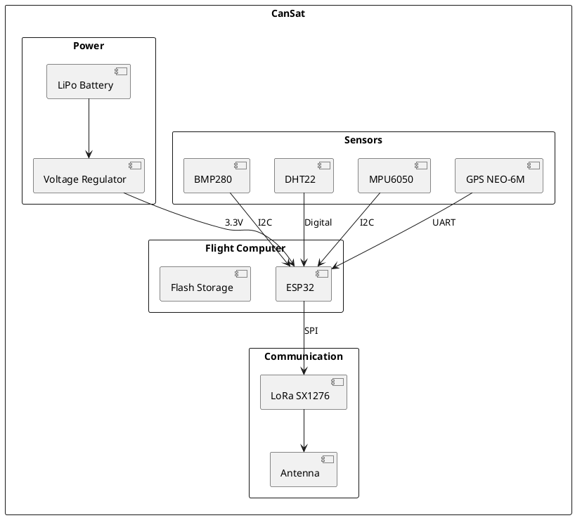

# System Architecture

> Overall system design and component selection.

## System Overview



## Component Selection

### Microcontroller
**Selected: ESP32-WROOM-32**

| Feature | Specification |
|---------|---------------|
| CPU | Dual-core 240MHz |
| RAM | 520KB |
| Flash | 4MB |
| GPIO | 34 pins |
| Interfaces | SPI, I2C, UART |

### Sensors

| Sensor | Measurement | Interface |
|--------|-------------|-----------|
| BMP280 | Pressure, Altitude | I2C |
| DHT22 | Temperature, Humidity | Digital |
| MPU6050 | Acceleration, Gyro | I2C |
| NEO-6M | GPS Position | UART |

## Data Flow

```
Sensors → ESP32 → Data Processing → LoRa TX → Ground Station
                 ↓
              SD Card (backup)
```

## Power Budget

| Component | Current (mA) | Duty Cycle | Average (mA) |
|-----------|-------------|------------|--------------|
| ESP32 | 80 | 100% | 80 |
| LoRa TX | 120 | 10% | 12 |
| Sensors | 15 | 100% | 15 |
| GPS | 45 | 100% | 45 |
| **Total** | - | - | **152** |

With a 2000mAh battery: ~13 hours runtime
