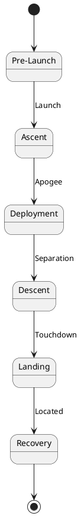

# Mission Profile

> Flight phases and operational timeline.

## Mission Phases



## Phase Details

### 1. Pre-Launch
- System check and calibration
- GPS lock confirmation
- Telemetry link verification
- Battery voltage check

### 2. Ascent (0 - 1000m)
- Passive data collection
- Low power mode
- Accelerometer monitoring

### 3. Deployment (~1000m)
- Separation from rocket
- Parachute deployment
- Full sensor activation

### 4. Descent (1000m - 0m)
- Active telemetry transmission
- 1 Hz data collection
- Real-time ground station display

### 5. Landing & Recovery
- GPS beacon mode
- Audio buzzer activation
- Data preservation

## Timeline

| Event | Time | Altitude |
|-------|------|----------|
| Launch | T+0s | 0m |
| Max Q | T+15s | 200m |
| Apogee | T+45s | 1000m |
| Deployment | T+46s | 990m |
| Touchdown | T+180s | 0m |

## Descent Rate Calculation

Target descent rate: **5-7 m/s**

```
v = sqrt(2mg / (ρ * Cd * A))

Where:
  m = 0.35 kg (mass)
  g = 9.81 m/s² (gravity)
  ρ = 1.225 kg/m³ (air density)
  Cd = 1.5 (parachute drag coefficient)
  A = parachute area (to be calculated)
```
