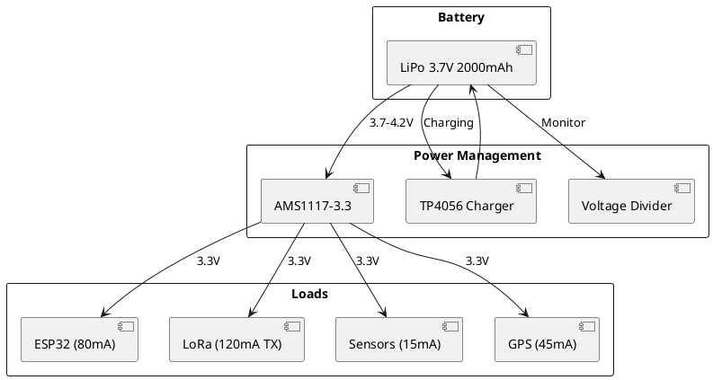

# Power System

> Battery selection and power management.

## Power Architecture



## Battery Selection

**Selected: LiPo 3.7V 2000mAh**

| Parameter | Value |
|-----------|-------|
| Chemistry | Lithium Polymer |
| Nominal Voltage | 3.7V |
| Capacity | 2000mAh |
| Discharge Rate | 1C (2A max) |
| Weight | ~40g |

## Power Budget

| Component | Active (mA) | Sleep (mA) | Duty | Avg (mA) |
|-----------|------------|------------|------|----------|
| ESP32 | 80 | 0.01 | 100% | 80 |
| LoRa TX | 120 | 0.2 | 10% | 12.2 |
| BMP280 | 0.7 | 0.003 | 100% | 0.7 |
| DHT22 | 1.5 | 0.05 | 10% | 0.2 |
| MPU6050 | 3.8 | 0.01 | 100% | 3.8 |
| GPS | 45 | 11 | 100% | 45 |
| **Total** | - | - | - | **~142** |

## Runtime Calculation

```
Runtime = Battery Capacity / Average Current
Runtime = 2000mAh / 142mA
Runtime = ~14 hours
```

**Safety margin**: 2 hours mission time is well within capacity.

## Voltage Monitoring

Monitor battery voltage via ADC:

```cpp
#define VBAT_PIN 34
#define VOLTAGE_DIVIDER_RATIO 2.0

float readBatteryVoltage() {
  int raw = analogRead(VBAT_PIN);
  float voltage = (raw / 4095.0) * 3.3 * VOLTAGE_DIVIDER_RATIO;
  return voltage;
}

int getBatteryPercent() {
  float voltage = readBatteryVoltage();
  // LiPo: 4.2V = 100%, 3.0V = 0%
  int percent = (voltage - 3.0) / (4.2 - 3.0) * 100;
  return constrain(percent, 0, 100);
}
```

## Protection Features

1. **Over-discharge protection**: Cut-off at 3.0V
2. **Over-current protection**: 2A fuse
3. **Reverse polarity**: Schottky diode
4. **Thermal management**: Temperature monitoring
