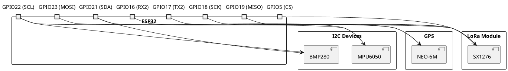

# Hardware

> Components, schematics, and PCB design for the CanSat.

## Contents

| # | Topic | Description |
|---|-------|-------------|
| 1 | [Microcontroller](./01-Microcontroller.md) | MCU selection and setup |
| 2 | [Sensors](./02-Sensors.md) | Sensor integration guide |
| 3 | [Power System](./03-PowerSystem.md) | Battery and power management |
| 4 | [PCB Design](./04-PCBDesign.md) | Circuit board design |

## Overview

This section covers all hardware aspects of the CanSat project, from component selection to final PCB manufacturing.

## Bill of Materials

| Component | Part Number | Quantity | Cost |
|-----------|-------------|----------|------|
| ESP32-WROOM-32 | - | 1 | $5 |
| BMP280 | GY-BMP280 | 1 | $3 |
| DHT22 | AM2302 | 1 | $4 |
| LoRa SX1276 | Ra-02 | 1 | $8 |
| GPS NEO-6M | GY-NEO6MV2 | 1 | $10 |
| LiPo 2000mAh | - | 1 | $12 |

## Wiring Diagram

## Prerequisites

- Soldering equipment
- Multimeter
- PCB manufacturing capability (or service)

## Next Steps

After completing hardware assembly, proceed to:
- [Software Development](../03-software/README.md)
