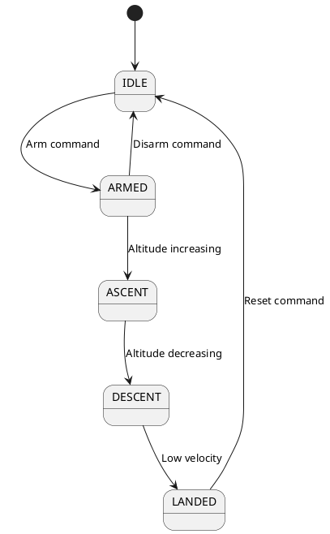

# Flight Software

> ESP32 firmware for the CanSat flight computer.

## Architecture

The flight software uses a state machine architecture with cooperative multitasking.

```cpp
enum FlightState {
  STATE_IDLE,
  STATE_ARMED,
  STATE_ASCENT,
  STATE_DESCENT,
  STATE_LANDED
};
```

## Main Loop

```cpp
void loop() {
  unsigned long currentMillis = millis();

  // Update sensors at 10 Hz
  if (currentMillis - lastSensorRead >= 100) {
    readSensors();
    lastSensorRead = currentMillis;
  }

  // Transmit telemetry at 1 Hz
  if (currentMillis - lastTelemetry >= 1000) {
    transmitTelemetry();
    lastTelemetry = currentMillis;
  }

  // Update state machine
  updateStateMachine();

  // Process GPS data
  processGPS();
}
```

## Telemetry Packet

```cpp
struct TelemetryPacket {
  uint32_t timestamp;     // ms since boot
  uint8_t state;          // Flight state
  float altitude;         // meters
  float temperature;      // Celsius
  float pressure;         // hPa
  float humidity;         // %
  float latitude;         // degrees
  float longitude;        // degrees
  float battery;          // Volts
  uint8_t checksum;       // XOR checksum
};
```

### Packet Format (Binary)

| Offset | Size | Field |
|--------|------|-------|
| 0 | 4 | Timestamp |
| 4 | 1 | State |
| 5 | 4 | Altitude |
| 9 | 4 | Temperature |
| 13 | 4 | Pressure |
| 17 | 4 | Humidity |
| 21 | 4 | Latitude |
| 25 | 4 | Longitude |
| 29 | 4 | Battery |
| 33 | 1 | Checksum |

Total: 34 bytes

## State Machine



## Error Handling

```cpp
enum ErrorCode {
  ERR_NONE = 0,
  ERR_SENSOR_INIT = 1,
  ERR_LORA_INIT = 2,
  ERR_GPS_TIMEOUT = 3,
  ERR_LOW_BATTERY = 4
};

void handleError(ErrorCode error) {
  // Log error
  logError(error);

  // Blink LED pattern
  blinkErrorCode(error);

  // Continue operation if possible
  if (error != ERR_LORA_INIT) {
    // Can still log to SD card
  }
}
```

## Build & Upload

```bash
# Build
pio run

# Upload
pio run --target upload

# Monitor serial
pio device monitor
```
