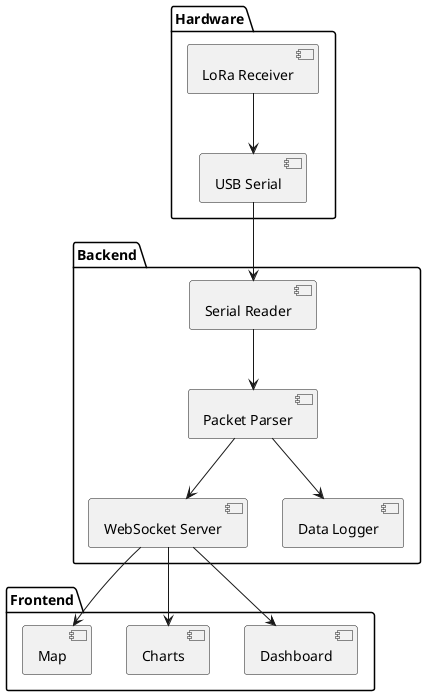

# Ground Station

> Real-time data reception and visualization.

## Overview

The ground station receives telemetry from the CanSat and provides real-time visualization and logging.

## Architecture



## Backend (Python)

### Dependencies
```bash
pip install pyserial websockets aiofiles
```

### Serial Reader
```python
import serial
import asyncio
import websockets
import json

class GroundStation:
    def __init__(self, port='/dev/ttyUSB0', baudrate=115200):
        self.serial = serial.Serial(port, baudrate)
        self.clients = set()

    async def read_telemetry(self):
        while True:
            if self.serial.in_waiting:
                data = self.serial.read(34)  # Packet size
                packet = self.parse_packet(data)
                await self.broadcast(packet)
            await asyncio.sleep(0.01)

    def parse_packet(self, data):
        # Parse binary packet
        import struct
        values = struct.unpack('<IB7fB', data)
        return {
            'timestamp': values[0],
            'state': values[1],
            'altitude': values[2],
            'temperature': values[3],
            'pressure': values[4],
            'humidity': values[5],
            'latitude': values[6],
            'longitude': values[7],
            'battery': values[8]
        }

    async def broadcast(self, packet):
        message = json.dumps(packet)
        for client in self.clients:
            await client.send(message)
```

## Frontend (React)

### Dashboard Component
```tsx
import React, { useEffect, useState } from 'react';
import { LineChart, Line, XAxis, YAxis } from 'recharts';

function Dashboard() {
  const [telemetry, setTelemetry] = useState([]);

  useEffect(() => {
    const ws = new WebSocket('ws://localhost:8765');
    ws.onmessage = (event) => {
      const packet = JSON.parse(event.data);
      setTelemetry(prev => [...prev.slice(-100), packet]);
    };
    return () => ws.close();
  }, []);

  return (
    <div className="dashboard">
      <MetricCard title="Altitude" value={telemetry.altitude} unit="m" />
      <MetricCard title="Temperature" value={telemetry.temperature} unit="°C" />
      <AltitudeChart data={telemetry} />
      <MapView lat={telemetry.latitude} lng={telemetry.longitude} />
    </div>
  );
}
```

## Data Logging

All received data is logged to CSV:

```
timestamp,state,altitude,temperature,pressure,humidity,lat,lng,battery
1234567,2,450.5,23.4,956.2,45.0,12.345,-98.765,3.85
```

## Running the Ground Station

```bash
# Start backend
python ground_station.py

# Start frontend (separate terminal)
cd frontend && npm start
```
