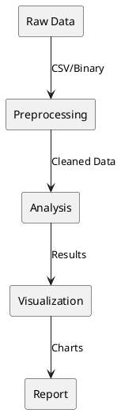

# Data Processing

> Post-flight telemetry analysis and visualization.

## Overview

After the mission, collected data is processed for analysis, reporting, and insight extraction.

## Data Pipeline



## Python Analysis Tools

### Loading Data
```python
import pandas as pd
import numpy as np

def load_telemetry(filename):
    df = pd.read_csv(filename)
    df['time'] = pd.to_datetime(df['timestamp'], unit='ms')
    return df

data = load_telemetry('flight_data.csv')
```

### Altitude Analysis
```python
def analyze_altitude(df):
    max_altitude = df['altitude'].max()
    avg_descent_rate = df['altitude'].diff().mean()

    # Find apogee
    apogee_idx = df['altitude'].idxmax()
    apogee_time = df.loc[apogee_idx, 'time']

    return {
        'max_altitude': max_altitude,
        'apogee_time': apogee_time,
        'descent_rate': abs(avg_descent_rate)
    }
```

### Flight Profile Visualization
```python
import matplotlib.pyplot as plt

def plot_flight_profile(df):
    fig, axes = plt.subplots(2, 2, figsize=(12, 10))

    # Altitude vs Time
    axes[0, 0].plot(df['time'], df['altitude'])
    axes[0, 0].set_title('Altitude Profile')
    axes[0, 0].set_ylabel('Altitude (m)')

    # Temperature vs Altitude
    axes[0, 1].scatter(df['altitude'], df['temperature'])
    axes[0, 1].set_title('Temperature vs Altitude')

    # Pressure vs Altitude
    axes[1, 0].scatter(df['altitude'], df['pressure'])
    axes[1, 0].set_title('Pressure vs Altitude')

    # GPS Track
    axes[1, 1].plot(df['longitude'], df['latitude'])
    axes[1, 1].set_title('GPS Track')

    plt.tight_layout()
    plt.savefig('flight_analysis.png')
```

## Jupyter Notebook

A comprehensive analysis notebook is provided:

```python
# flight_analysis.ipynb

# Cell 1: Load data
import pandas as pd
import matplotlib.pyplot as plt

df = pd.read_csv('flight_data.csv')

# Cell 2: Summary statistics
print(df.describe())

# Cell 3: Altitude profile
plt.figure(figsize=(10, 6))
plt.plot(df['timestamp'] / 1000, df['altitude'])
plt.xlabel('Time (s)')
plt.ylabel('Altitude (m)')
plt.title('CanSat Flight Profile')
plt.grid(True)
plt.show()

# Cell 4: Descent rate calculation
df['descent_rate'] = -df['altitude'].diff() / (df['timestamp'].diff() / 1000)
print(f"Average descent rate: {df['descent_rate'].mean():.2f} m/s")
```

## Report Generation

Generate PDF reports with mission summary:

```python
from reportlab.lib import colors
from reportlab.platypus import SimpleDocTemplate, Table, Paragraph

def generate_report(analysis_results, output_file):
    doc = SimpleDocTemplate(output_file)
    story = []

    # Add title
    story.append(Paragraph("CanSat Mission Report"))

    # Add summary table
    data = [
        ['Metric', 'Value'],
        ['Max Altitude', f"{analysis_results['max_altitude']:.1f} m"],
        ['Descent Rate', f"{analysis_results['descent_rate']:.2f} m/s"],
        ['Flight Duration', analysis_results['duration']],
    ]
    table = Table(data)
    story.append(table)

    doc.build(story)
```
