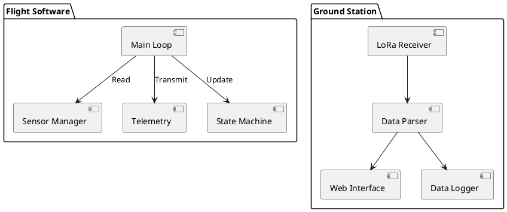

# Software

> Firmware and ground station software development.

## Contents

| # | Topic | Description |
|---|-------|-------------|
| 1 | [Flight Software](./01-FlightSoftware.md) | Embedded firmware |
| 2 | [Ground Station](./02-GroundStation.md) | Data reception and display |
| 3 | [Data Processing](./03-DataProcessing.md) | Telemetry analysis |

## Overview

The software stack consists of three main components:
1. **Flight Software**: Runs on the ESP32, handles sensors and telemetry
2. **Ground Station**: Receives and displays real-time data
3. **Data Processing**: Post-flight analysis tools

## Architecture



## Development Setup

### Prerequisites
- VS Code with PlatformIO
- Python 3.10+
- Node.js 18+

### Repository Structure
```
software/
├── flight/          # ESP32 firmware
├── ground/          # Ground station
└── analysis/        # Data processing
```
