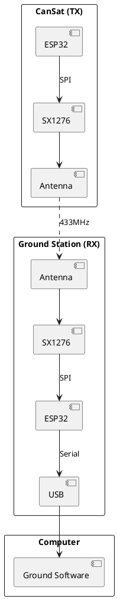

# Communication

> RF protocols and telemetry system.

## Contents

| # | Topic | Description |
|---|-------|-------------|
| 1 | [Radio Protocol](./01-RadioProtocol.md) | LoRa configuration |
| 2 | [Telemetry](./02-Telemetry.md) | Data transmission format |

## Overview

The CanSat uses LoRa (Long Range) radio technology for telemetry transmission. This provides reliable long-range communication with low power consumption.

## System Architecture



## RF Specifications

| Parameter | Value |
|-----------|-------|
| Frequency | 433.0 MHz |
| Modulation | LoRa |
| Bandwidth | 125 kHz |
| Spreading Factor | 7 |
| Coding Rate | 4/5 |
| TX Power | +17 dBm |
| Link Budget | 148 dB |

## Link Budget Calculation

```
Link Budget = TX Power + TX Antenna Gain + RX Antenna Gain - Path Loss - Margin

At 1 km distance:
Path Loss = 20 * log10(4 * π * d / λ)
Path Loss = 20 * log10(4 * π * 1000 / 0.69) ≈ 85 dB

Available: 17 + 2 + 2 - 85 = -64 dBm
Sensitivity: -148 dBm (SF7, BW125)
Margin: 84 dB ✓
```
