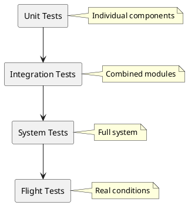

# Testing

> Test plans and validation procedures.

## Contents

| # | Topic | Description |
|---|-------|-------------|
| 1 | [Unit Tests](./01-UnitTests.md) | Component testing |
| 2 | [Integration Tests](./02-IntegrationTests.md) | System testing |

## Testing Strategy

## Test Categories

### 1. Unit Tests
- Individual sensor readings
- Communication module
- Power system
- Software functions

### 2. Integration Tests
- Sensor + MCU integration
- Telemetry chain
- Ground station link

### 3. System Tests
- Full system operation
- Environmental testing
- Drop tests

### 4. Flight Tests
- Balloon tests
- Rocket deployment simulation

## Test Equipment

| Equipment | Purpose |
|-----------|---------|
| Multimeter | Voltage/current measurement |
| Oscilloscope | Signal analysis |
| Environmental chamber | Temperature testing |
| Altitude simulator | Pressure testing |
| RF analyzer | Radio testing |

## Pass/Fail Criteria

| Test | Pass Criteria |
|------|---------------|
| Telemetry Range | > 1 km |
| Temperature Accuracy | ± 1°C |
| Pressure Accuracy | ± 2 hPa |
| GPS Lock Time | < 60 seconds |
| Battery Life | > 2 hours |
