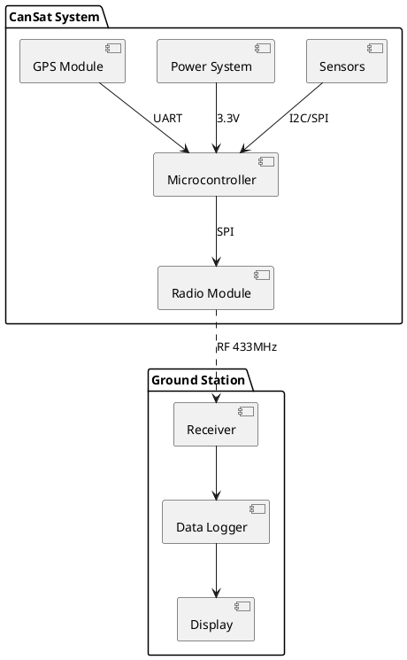

# CanSat Mission

> Satellite-in-a-can competition project with telemetry, sensors, and data analysis.

## Overview

The CanSat project is a compact satellite simulation designed to fit within the volume of a standard soda can. This educational project teaches real-world aerospace engineering concepts including telemetry, sensor integration, embedded systems, and data analysis.

Our mission focuses on atmospheric data collection during descent, including temperature, pressure, humidity, and GPS position. The data is transmitted in real-time to our ground station for monitoring and post-flight analysis.

## Quick Links

| Section | Description |
|---------|-------------|
| [Mission Design](./01-mission-design/README.md) | Requirements, architecture, timeline |
| [Hardware](./02-hardware/README.md) | Components, schematics, PCB design |
| [Software](./03-software/README.md) | Firmware, ground station, data processing |
| [Communication](./04-communication/README.md) | RF protocols, telemetry, data link |
| [Testing](./05-testing/README.md) | Test plans, results, validation |

## Architecture

## Tech Stack

| Category | Technologies |
|----------|-------------|
| Microcontroller | ESP32, STM32, Arduino Nano |
| Sensors | BMP280, DHT22, MPU6050 |
| Communication | LoRa SX1276, 433MHz RF |
| Software | C++, Python, React |
| Tools | KiCad, PlatformIO, VS Code |

## Team

| Role | Member |
|------|--------|
| Project Lead | TBD |
| Hardware Engineer | TBD |
| Software Engineer | TBD |
| Ground Station | TBD |

## Status

- [ ] Phase 1: Design & Requirements
- [ ] Phase 2: Hardware Development
- [ ] Phase 3: Software Development
- [ ] Phase 4: Integration & Testing
- [ ] Phase 5: Competition

## Getting Started

1. Review the [Mission Design](./01-mission-design/README.md) documentation
2. Follow the [Hardware Setup](./02-hardware/README.md) guide
3. Build the [Software](./03-software/README.md) components
4. Run [Tests](./05-testing/README.md) to validate the system
