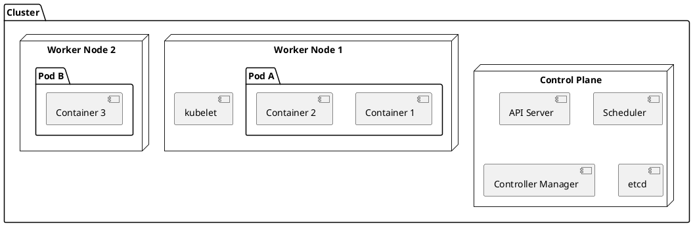

# Kubernetes

> Container orchestration at scale.

## Overview

Kubernetes (K8s) automates deployment, scaling, and management of containerized applications.

## Core Concepts



## Local Setup

### Minikube
```bash
# Install
curl -LO https://storage.googleapis.com/minikube/releases/latest/minikube-linux-amd64
sudo install minikube-linux-amd64 /usr/local/bin/minikube

# Start cluster
minikube start

# Enable addons
minikube addons enable ingress
minikube addons enable metrics-server
```

### kubectl
```bash
# Install
curl -LO "https://dl.k8s.io/release/$(curl -L -s https://dl.k8s.io/release/stable.txt)/bin/linux/amd64/kubectl"
sudo install kubectl /usr/local/bin/kubectl

# Verify
kubectl version --client
```

## Basic Resources

### Pod
```yaml
# pod.yaml
apiVersion: v1
kind: Pod
metadata:
  name: myapp
  labels:
    app: myapp
spec:
  containers:
    - name: myapp
      image: myapp:v1
      ports:
        - containerPort: 3000
      resources:
        limits:
          memory: "128Mi"
          cpu: "500m"
```

### Deployment
```yaml
# deployment.yaml
apiVersion: apps/v1
kind: Deployment
metadata:
  name: myapp
spec:
  replicas: 3
  selector:
    matchLabels:
      app: myapp
  template:
    metadata:
      labels:
        app: myapp
    spec:
      containers:
        - name: myapp
          image: myapp:v1
          ports:
            - containerPort: 3000
          env:
            - name: NODE_ENV
              value: "production"
          resources:
            limits:
              memory: "256Mi"
              cpu: "500m"
            requests:
              memory: "128Mi"
              cpu: "250m"
          livenessProbe:
            httpGet:
              path: /health
              port: 3000
            initialDelaySeconds: 30
            periodSeconds: 10
          readinessProbe:
            httpGet:
              path: /ready
              port: 3000
            initialDelaySeconds: 5
            periodSeconds: 5
```

### Service
```yaml
# service.yaml
apiVersion: v1
kind: Service
metadata:
  name: myapp
spec:
  type: ClusterIP
  selector:
    app: myapp
  ports:
    - port: 80
      targetPort: 3000
---
# NodePort for external access
apiVersion: v1
kind: Service
metadata:
  name: myapp-nodeport
spec:
  type: NodePort
  selector:
    app: myapp
  ports:
    - port: 80
      targetPort: 3000
      nodePort: 30080
```

### Ingress
```yaml
# ingress.yaml
apiVersion: networking.k8s.io/v1
kind: Ingress
metadata:
  name: myapp
  annotations:
    nginx.ingress.kubernetes.io/rewrite-target: /
spec:
  rules:
    - host: myapp.local
      http:
        paths:
          - path: /
            pathType: Prefix
            backend:
              service:
                name: myapp
                port:
                  number: 80
```

### ConfigMap
```yaml
# configmap.yaml
apiVersion: v1
kind: ConfigMap
metadata:
  name: myapp-config
data:
  DATABASE_HOST: "postgres"
  LOG_LEVEL: "info"
```

### Secret
```yaml
# secret.yaml
apiVersion: v1
kind: Secret
metadata:
  name: myapp-secrets
type: Opaque
stringData:
  DATABASE_PASSWORD: "supersecret"
  API_KEY: "abc123"
```

## kubectl Commands

```bash
# Apply configuration
kubectl apply -f deployment.yaml

# Get resources
kubectl get pods
kubectl get deployments
kubectl get services

# Describe resource
kubectl describe pod myapp-xyz

# View logs
kubectl logs myapp-xyz
kubectl logs -f myapp-xyz  # Follow

# Execute command
kubectl exec -it myapp-xyz -- /bin/sh

# Port forward
kubectl port-forward svc/myapp 8080:80

# Scale
kubectl scale deployment myapp --replicas=5

# Rollout
kubectl rollout status deployment/myapp
kubectl rollout history deployment/myapp
kubectl rollout undo deployment/myapp
```

## Namespace Organization

```yaml
# namespace.yaml
apiVersion: v1
kind: Namespace
metadata:
  name: production
---
apiVersion: v1
kind: Namespace
metadata:
  name: staging
```

```bash
# Use namespace
kubectl config set-context --current --namespace=production
```
