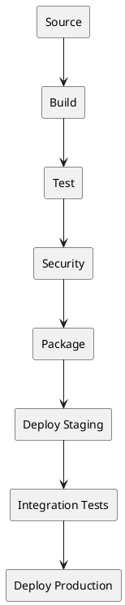

# Pipeline Design

> CI/CD pipeline patterns and best practices.

## Pipeline Stages



## Stage Details

### 1. Source
- Checkout code
- Fetch dependencies
- Validate commit messages

### 2. Build
- Compile code
- Generate assets
- Create artifacts

### 3. Test
- Unit tests
- Code coverage
- Snapshot tests

### 4. Security
- Dependency scanning
- SAST (Static Analysis)
- Secret detection

### 5. Package
- Build Docker image
- Create release archives
- Generate documentation

### 6. Deploy Staging
- Deploy to test environment
- Smoke tests
- Environment validation

### 7. Integration Tests
- E2E tests
- Performance tests
- API contract tests

### 8. Deploy Production
- Blue/green or canary deploy
- Health checks
- Monitoring verification

## Example Multi-Stage Pipeline

```yaml
name: Full CI/CD Pipeline

on:
  push:
    branches: [main]

jobs:
  # Stage 1: Build & Test
  build:
    runs-on: ubuntu-latest
    outputs:
      version: ${{ steps.version.outputs.version }}

    steps:
      - uses: actions/checkout@v4

      - name: Setup Node
        uses: actions/setup-node@v4
        with:
          node-version: '18'
          cache: 'npm'

      - name: Install
        run: npm ci

      - name: Lint
        run: npm run lint

      - name: Test
        run: npm run test:ci

      - name: Build
        run: npm run build

      - name: Get version
        id: version
        run: echo "version=$(node -p "require('./package.json').version")" >> $GITHUB_OUTPUT

      - name: Upload artifact
        uses: actions/upload-artifact@v4
        with:
          name: build-${{ steps.version.outputs.version }}
          path: dist/

  # Stage 2: Security Scan
  security:
    needs: build
    runs-on: ubuntu-latest

    steps:
      - uses: actions/checkout@v4

      - name: Run Snyk
        uses: snyk/actions/node@master
        env:
          SNYK_TOKEN: ${{ secrets.SNYK_TOKEN }}

      - name: Run CodeQL
        uses: github/codeql-action/analyze@v2

  # Stage 3: Build Docker Image
  package:
    needs: [build, security]
    runs-on: ubuntu-latest

    steps:
      - uses: actions/checkout@v4

      - name: Download artifact
        uses: actions/download-artifact@v4
        with:
          name: build-${{ needs.build.outputs.version }}
          path: dist/

      - name: Build and push Docker image
        uses: docker/build-push-action@v5
        with:
          context: .
          push: true
          tags: |
            myapp:${{ needs.build.outputs.version }}
            myapp:latest

  # Stage 4: Deploy to Staging
  deploy-staging:
    needs: package
    runs-on: ubuntu-latest
    environment: staging

    steps:
      - name: Deploy to staging
        run: |
          kubectl set image deployment/myapp \
            myapp=myapp:${{ needs.build.outputs.version }}
          kubectl rollout status deployment/myapp

      - name: Run smoke tests
        run: |
          curl -f https://staging.example.com/health

  # Stage 5: Integration Tests
  integration-tests:
    needs: deploy-staging
    runs-on: ubuntu-latest

    steps:
      - uses: actions/checkout@v4

      - name: Run E2E tests
        run: npm run test:e2e
        env:
          BASE_URL: https://staging.example.com

  # Stage 6: Deploy to Production
  deploy-production:
    needs: integration-tests
    runs-on: ubuntu-latest
    environment: production

    steps:
      - name: Deploy to production
        run: |
          kubectl set image deployment/myapp \
            myapp=myapp:${{ needs.build.outputs.version }}
          kubectl rollout status deployment/myapp

      - name: Verify deployment
        run: |
          curl -f https://example.com/health
```

## Pipeline Optimization

### Parallelization
```yaml
jobs:
  lint:
    runs-on: ubuntu-latest
    steps:
      - run: npm run lint

  test-unit:
    runs-on: ubuntu-latest
    steps:
      - run: npm run test:unit

  test-integration:
    runs-on: ubuntu-latest
    steps:
      - run: npm run test:integration

  build:
    needs: [lint, test-unit, test-integration]
    runs-on: ubuntu-latest
    steps:
      - run: npm run build
```

### Matrix Builds
```yaml
jobs:
  test:
    strategy:
      matrix:
        os: [ubuntu-latest, macos-latest, windows-latest]
        node: [16, 18, 20]
    runs-on: ${{ matrix.os }}
    steps:
      - uses: actions/setup-node@v4
        with:
          node-version: ${{ matrix.node }}
      - run: npm test
```

### Fail Fast
```yaml
strategy:
  fail-fast: true  # Stop all jobs if one fails
  matrix:
    node: [16, 18, 20]
```

## Best Practices

1. **Keep pipelines fast** (< 10 minutes)
2. **Fail fast** - run quick checks first
3. **Cache dependencies** aggressively
4. **Parallelize** independent jobs
5. **Use artifacts** to pass data between jobs
6. **Secure secrets** - never log them
7. **Test the pipeline** itself
