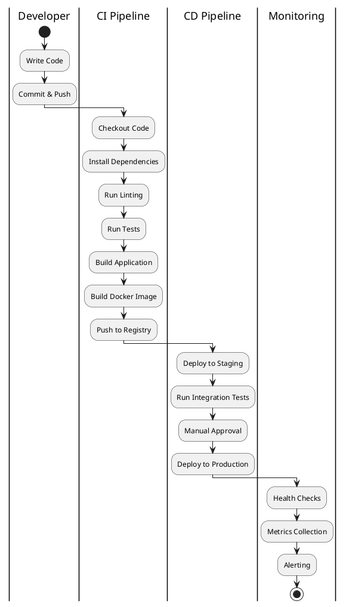

# CI/CD

> Continuous Integration and Continuous Deployment.

## Contents

| # | Topic | Description |
|---|-------|-------------|
| 1 | [GitHub Actions](./01-GitHubActions.md) | GitHub-native CI/CD |
| 2 | [Pipelines](./02-Pipelines.md) | Pipeline design patterns |
| 3 | [Deployment](./03-Deployment.md) | Deployment strategies |

## CI/CD Pipeline Overview

## Key Principles

### Continuous Integration
- Merge frequently (daily or more)
- Automated build on every push
- Fast feedback on failures
- Keep the build green

### Continuous Deployment
- Automate deployments
- Deploy to staging first
- Use feature flags
- Enable quick rollbacks

## Tools Comparison

| Tool | Hosted | Self-Hosted | Strengths |
|------|--------|-------------|-----------|
| GitHub Actions | Yes | Yes | Native GitHub integration |
| GitLab CI | Yes | Yes | Built into GitLab |
| Jenkins | No | Yes | Highly customizable |
| CircleCI | Yes | No | Fast, good caching |
| Travis CI | Yes | No | Simple configuration |

## Prerequisites

- Git repository
- Basic YAML knowledge
- Understanding of your build process
- Docker knowledge (for containerized builds)
