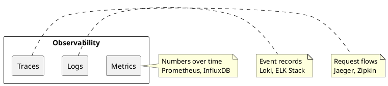
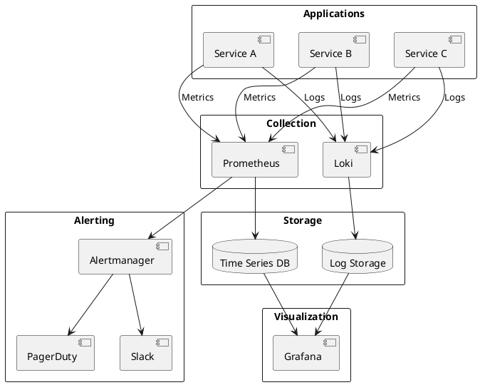

# Monitoring

> Observability stack for infrastructure and applications.

## Contents

| # | Topic | Description |
|---|-------|-------------|
| 1 | [Prometheus](./01-Prometheus.md) | Metrics collection |
| 2 | [Grafana](./02-Grafana.md) | Visualization dashboards |

## Observability Pillars



## Stack Overview

| Component | Purpose | Tool |
|-----------|---------|------|
| Metrics | Collect measurements | Prometheus |
| Visualization | Dashboards | Grafana |
| Logs | Aggregate logs | Loki |
| Alerting | Notifications | Alertmanager |
| Tracing | Distributed tracing | Jaeger |

## Architecture



## Quick Start with Docker Compose

```yaml
version: '3.8'

services:
  prometheus:
    image: prom/prometheus:latest
    ports:
      - "9090:9090"
    volumes:
      - ./prometheus.yml:/etc/prometheus/prometheus.yml
      - prometheus-data:/prometheus

  grafana:
    image: grafana/grafana:latest
    ports:
      - "3000:3000"
    environment:
      - GF_SECURITY_ADMIN_PASSWORD=admin
    volumes:
      - grafana-data:/var/lib/grafana

  alertmanager:
    image: prom/alertmanager:latest
    ports:
      - "9093:9093"
    volumes:
      - ./alertmanager.yml:/etc/alertmanager/alertmanager.yml

volumes:
  prometheus-data:
  grafana-data:
```

## Key Metrics to Monitor

### System Metrics
- CPU usage
- Memory usage
- Disk I/O
- Network traffic

### Application Metrics
- Request rate
- Error rate
- Response latency
- Active connections

### Business Metrics
- User signups
- Orders placed
- Revenue
- Conversion rate

## Golden Signals

Google's four golden signals for monitoring:

1. **Latency**: Time to serve requests
2. **Traffic**: Demand on the system
3. **Errors**: Rate of failed requests
4. **Saturation**: How "full" the system is
