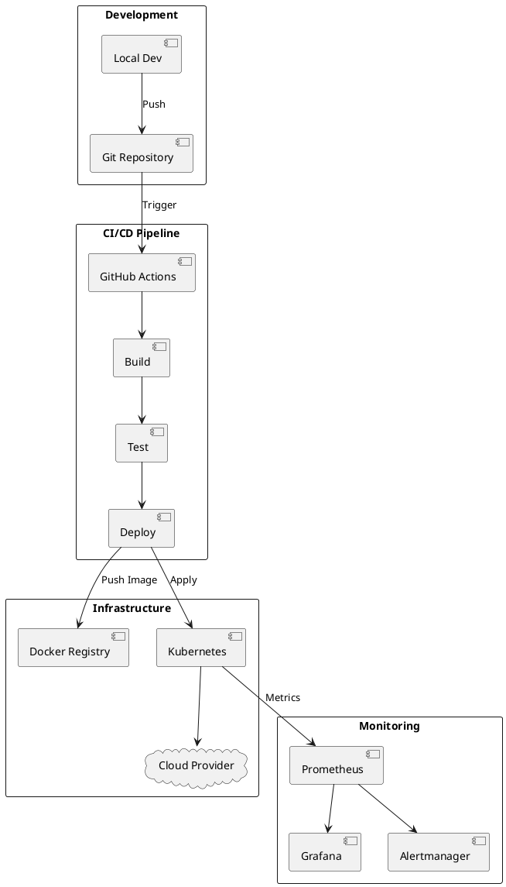

# DevOps Infrastructure

> CI/CD pipelines, containerization, and infrastructure as code.

## Overview

This section covers DevOps practices and tools for managing our team's infrastructure, deployments, and development workflows.

Modern DevOps enables rapid, reliable software delivery through automation, monitoring, and collaboration between development and operations.

## Quick Links

| Section | Description |
|---------|-------------|
| [Containerization](./01-containerization/README.md) | Docker and Kubernetes |
| [CI/CD](./02-cicd/README.md) | Automated pipelines |
| [Monitoring](./03-monitoring/README.md) | Observability stack |

## Architecture

## Tech Stack

| Category | Technologies |
|----------|-------------|
| Containers | Docker, Podman |
| Orchestration | Kubernetes, Docker Compose |
| CI/CD | GitHub Actions, GitLab CI |
| IaC | Terraform, Ansible |
| Monitoring | Prometheus, Grafana, Loki |
| Cloud | AWS, GCP, Azure, DigitalOcean |

## Key Concepts

### Infrastructure as Code (IaC)
Define infrastructure using code, enabling version control, review, and reproducibility.

### Continuous Integration (CI)
Automatically build and test code changes.

### Continuous Deployment (CD)
Automatically deploy validated changes to production.

### GitOps
Use Git as the single source of truth for infrastructure and applications.

## Getting Started

1. Install [Docker](./01-containerization/01-Docker.md)
2. Learn [Docker Compose](./01-containerization/02-DockerCompose.md)
3. Set up [GitHub Actions](./02-cicd/01-GitHubActions.md)
4. Configure [Monitoring](./03-monitoring/README.md)
