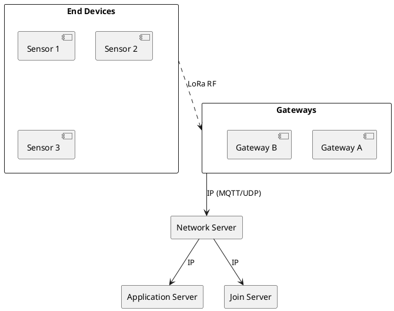

# LoRaWAN

> Network protocol for LoRa-based IoT networks.

## Overview

LoRaWAN is a media access control (MAC) protocol for wide area networks designed to allow low-powered devices to communicate with Internet-connected applications over long-range wireless connections.

## Network Architecture



## Device Classes

### Class A (All)
- **Lowest power**
- TX followed by two short RX windows
- Best for battery-powered sensors

### Class B (Beacon)
- **Scheduled receive**
- Synchronized with network beacons
- Predictable downlink latency

### Class C (Continuous)
- **Always listening**
- Lowest latency downlink
- Mains-powered devices

## Activation Methods

### OTAA (Over-The-Air Activation)
- **Preferred method**
- Device joins network dynamically
- Session keys generated per join

Required credentials:
- DevEUI (Device identifier)
- AppEUI/JoinEUI (Application identifier)
- AppKey (Root key)

### ABP (Activation By Personalization)
- Pre-configured session keys
- No join procedure
- Less secure, simpler

Required credentials:
- DevAddr (Device address)
- NwkSKey (Network session key)
- AppSKey (Application session key)

## Security

LoRaWAN provides two layers of encryption:

1. **Network Layer**: NwkSKey
   - Ensures message integrity
   - MIC (Message Integrity Code)

2. **Application Layer**: AppSKey
   - End-to-end encryption
   - Payload confidential from network

```
Encrypted Payload = AES-128(AppSKey, Payload)
MIC = AES-128(NwkSKey, Header + Payload)
```

## Frame Structure

```
| Preamble | PHDR | PHDR_CRC | PHYPayload | CRC |

PHYPayload:
| MHDR (1B) | MACPayload | MIC (4B) |

MACPayload:
| FHDR | FPort (1B) | FRMPayload |
```

## Data Rate Selection (ADR)

Adaptive Data Rate automatically optimizes:
- Spreading Factor
- TX Power
- Based on link quality

## Regional Parameters

| Region | Frequency | Channels | Max Power |
|--------|-----------|----------|-----------|
| EU868 | 868 MHz | 8+ | 14 dBm |
| US915 | 915 MHz | 64+8 | 30 dBm |
| AU915 | 915 MHz | 64+8 | 30 dBm |
| AS923 | 923 MHz | Variable | 16 dBm |

## Network Providers

- **The Things Network (TTN)**: Free community network
- **Helium**: Decentralized network
- **AWS IoT Core for LoRaWAN**: Enterprise
- **ChirpStack**: Open-source self-hosted
