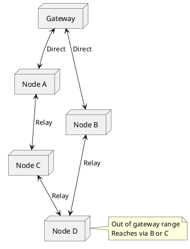

# Mesh Network

> Multi-hop LoRa network for extended coverage.

## Overview

A mesh network allows nodes to relay messages, extending coverage beyond single-hop range.

## Network Topology



## Protocol Design

### Packet Format

```cpp
struct MeshPacket {
  uint8_t destAddr;      // Final destination
  uint8_t srcAddr;       // Original source
  uint8_t senderAddr;    // Last hop sender
  uint8_t hopCount;      // TTL (decrements)
  uint8_t packetId;      // Unique ID
  uint8_t payloadLen;
  uint8_t payload[200];
  uint8_t checksum;
};
```

### Routing Table

```cpp
struct RouteEntry {
  uint8_t destAddr;
  uint8_t nextHop;
  uint8_t hopCount;
  int8_t rssi;
  uint32_t lastSeen;
};

RouteEntry routingTable[MAX_ROUTES];
```

## Mesh Node Implementation

```cpp
#include <SPI.h>
#include <LoRa.h>

#define MY_ADDRESS 0x02
#define MAX_HOPS 5
#define MAX_ROUTES 20

struct MeshPacket {
  uint8_t destAddr;
  uint8_t srcAddr;
  uint8_t senderAddr;
  uint8_t hopCount;
  uint8_t packetId;
  uint8_t payloadLen;
  uint8_t payload[200];
  uint8_t checksum;
};

struct RouteEntry {
  uint8_t destAddr;
  uint8_t nextHop;
  uint8_t hopCount;
  int8_t rssi;
  uint32_t lastSeen;
  bool valid;
};

RouteEntry routes[MAX_ROUTES];
uint8_t seenPackets[50];
uint8_t seenIndex = 0;

void setup() {
  Serial.begin(115200);

  LoRa.setPins(5, 14, 26);
  if (!LoRa.begin(868E6)) {
    while (1);
  }

  LoRa.setSpreadingFactor(9);
  memset(routes, 0, sizeof(routes));

  Serial.printf("Mesh node 0x%02X ready\n", MY_ADDRESS);
}

void loop() {
  receivePackets();

  // Periodic route maintenance
  static unsigned long lastMaintenance = 0;
  if (millis() - lastMaintenance > 60000) {
    expireOldRoutes();
    sendBeacon();
    lastMaintenance = millis();
  }
}

void receivePackets() {
  int size = LoRa.parsePacket();
  if (size < 7) return;

  MeshPacket pkt;
  LoRa.readBytes((uint8_t*)&pkt, size);

  // Check if we've seen this packet
  if (isDuplicate(pkt.srcAddr, pkt.packetId)) {
    return;
  }
  markSeen(pkt.srcAddr, pkt.packetId);

  // Update routing table from sender
  updateRoute(pkt.senderAddr, pkt.senderAddr, 1, LoRa.packetRssi());
  updateRoute(pkt.srcAddr, pkt.senderAddr, pkt.hopCount, LoRa.packetRssi());

  // Is this packet for us?
  if (pkt.destAddr == MY_ADDRESS) {
    handlePacket(&pkt);
  }
  // Broadcast?
  else if (pkt.destAddr == 0xFF) {
    handlePacket(&pkt);
    forwardPacket(&pkt);
  }
  // Forward if we can
  else if (pkt.hopCount < MAX_HOPS) {
    forwardPacket(&pkt);
  }
}

void forwardPacket(MeshPacket* pkt) {
  pkt->senderAddr = MY_ADDRESS;
  pkt->hopCount++;

  // Small delay to avoid collisions
  delay(random(10, 50));

  LoRa.beginPacket();
  LoRa.write((uint8_t*)pkt, 7 + pkt->payloadLen);
  LoRa.endPacket();

  Serial.printf("Forwarded packet from 0x%02X to 0x%02X\n",
                pkt->srcAddr, pkt->destAddr);
}

void sendPacket(uint8_t dest, uint8_t* data, uint8_t len) {
  static uint8_t packetCounter = 0;

  MeshPacket pkt;
  pkt.destAddr = dest;
  pkt.srcAddr = MY_ADDRESS;
  pkt.senderAddr = MY_ADDRESS;
  pkt.hopCount = 0;
  pkt.packetId = packetCounter++;
  pkt.payloadLen = len;
  memcpy(pkt.payload, data, len);

  LoRa.beginPacket();
  LoRa.write((uint8_t*)&pkt, 7 + len);
  LoRa.endPacket();
}

void handlePacket(MeshPacket* pkt) {
  Serial.printf("Received from 0x%02X: ", pkt->srcAddr);
  for (int i = 0; i < pkt->payloadLen; i++) {
    Serial.print((char)pkt->payload[i]);
  }
  Serial.println();
}

void updateRoute(uint8_t dest, uint8_t nextHop, uint8_t hops, int8_t rssi) {
  // Find existing or empty slot
  int slot = -1;
  for (int i = 0; i < MAX_ROUTES; i++) {
    if (routes[i].destAddr == dest) {
      slot = i;
      break;
    }
    if (!routes[i].valid && slot == -1) {
      slot = i;
    }
  }

  if (slot >= 0) {
    routes[slot].destAddr = dest;
    routes[slot].nextHop = nextHop;
    routes[slot].hopCount = hops;
    routes[slot].rssi = rssi;
    routes[slot].lastSeen = millis();
    routes[slot].valid = true;
  }
}

void sendBeacon() {
  uint8_t beacon[] = "BEACON";
  sendPacket(0xFF, beacon, 6);
}

void expireOldRoutes() {
  for (int i = 0; i < MAX_ROUTES; i++) {
    if (routes[i].valid && millis() - routes[i].lastSeen > 300000) {
      routes[i].valid = false;
    }
  }
}

bool isDuplicate(uint8_t src, uint8_t id) {
  uint16_t key = (src << 8) | id;
  for (int i = 0; i < 50; i++) {
    if (seenPackets[i] == key) return true;
  }
  return false;
}

void markSeen(uint8_t src, uint8_t id) {
  seenPackets[seenIndex++] = (src << 8) | id;
  if (seenIndex >= 50) seenIndex = 0;
}
```

## Testing the Mesh

1. Deploy 3+ nodes
2. Ensure at least one pair can't directly communicate
3. Send messages across the network
4. Monitor routing tables and hop counts
