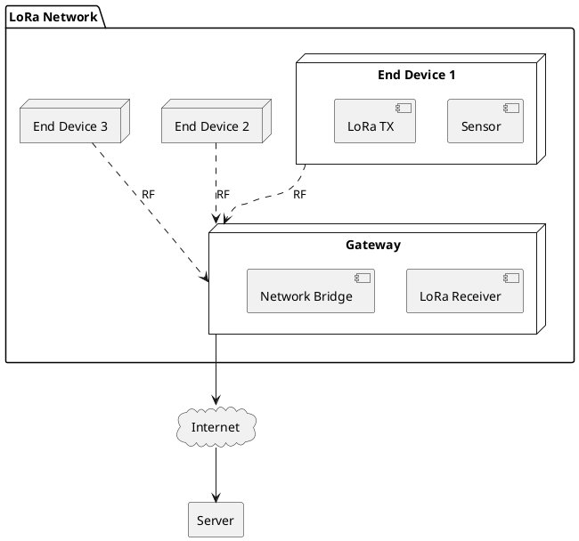

# LoRa Communication

> Long-range IoT communication system for remote sensor networks.

## Overview

This project explores LoRa (Long Range) wireless communication technology for building robust IoT networks. We cover everything from basic point-to-point communication to complex mesh networks.

LoRa provides excellent range (up to 15+ km in ideal conditions) with minimal power consumption, making it perfect for remote sensing, agriculture, and industrial monitoring applications.

## Quick Links

| Section | Description |
|---------|-------------|
| [Fundamentals](./01-fundamentals/README.md) | LoRa basics and theory |
| [Hardware Setup](./02-hardware-setup/README.md) | Modules, antennas, wiring |
| [Software](./03-software/README.md) | Libraries and code |
| [Projects](./04-projects/README.md) | Practical implementations |

## Architecture

## Tech Stack

| Category | Technologies |
|----------|-------------|
| Modules | SX1276, SX1278, RFM95 |
| MCU | ESP32, Arduino, STM32 |
| Protocols | LoRa, LoRaWAN |
| Software | Arduino IDE, PlatformIO |
| Network | TTN, ChirpStack |

## Key Features

- **Long Range**: 2-15 km typical, up to 80km LoS
- **Low Power**: Years on battery power
- **License-Free**: ISM bands (433/868/915 MHz)
- **Spread Spectrum**: Resistant to interference
- **Scalable**: Thousands of nodes per gateway

## Applications

- Environmental monitoring
- Smart agriculture
- Asset tracking
- Industrial IoT
- Smart city infrastructure
- Remote metering

## Getting Started

1. Review [LoRa Fundamentals](./01-fundamentals/README.md)
2. Set up your [Hardware](./02-hardware-setup/README.md)
3. Install the [Software](./03-software/README.md)
4. Build your first [Project](./04-projects/README.md)
